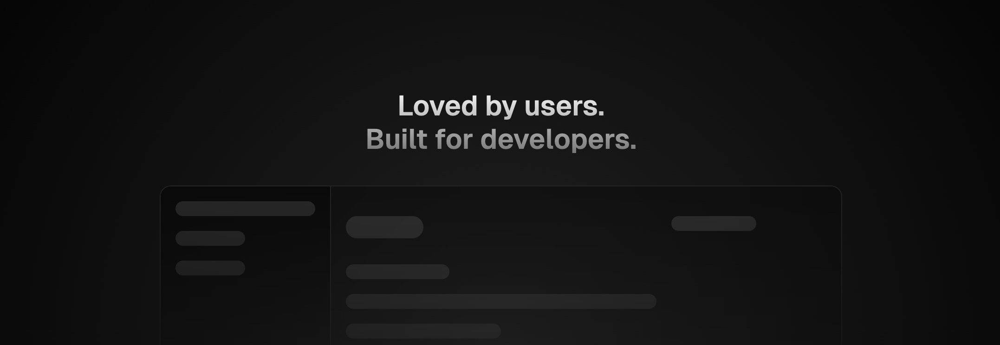

<p align="center">
  <!--  -->
  <h1 align="center">daniel/craft</h1>
  <p align="center">
    ✨ <a href="https://github.com/duongductrong/craft">craft.danielll.dev</a> ✨
    <br/>
    Craft is open-source built with Next.js / Fumadocs.
  </p>
</p>

<p align="center">
  
</p>

<p align="center">
  <a href="https://github.com/duongductrong" rel="nofollow"></a>
</p>

## Getting Started

First, run the development server:

```bash
npm run dev
# or
yarn dev
# or
pnpm dev
```

Open [http://localhost:3000](http://localhost:3000) with your browser to see the result.

## Contributing

Any contributions are welcome. Please read the [contribution guide](./CONTRIBUTING.md) before you start.

## License

MIT
